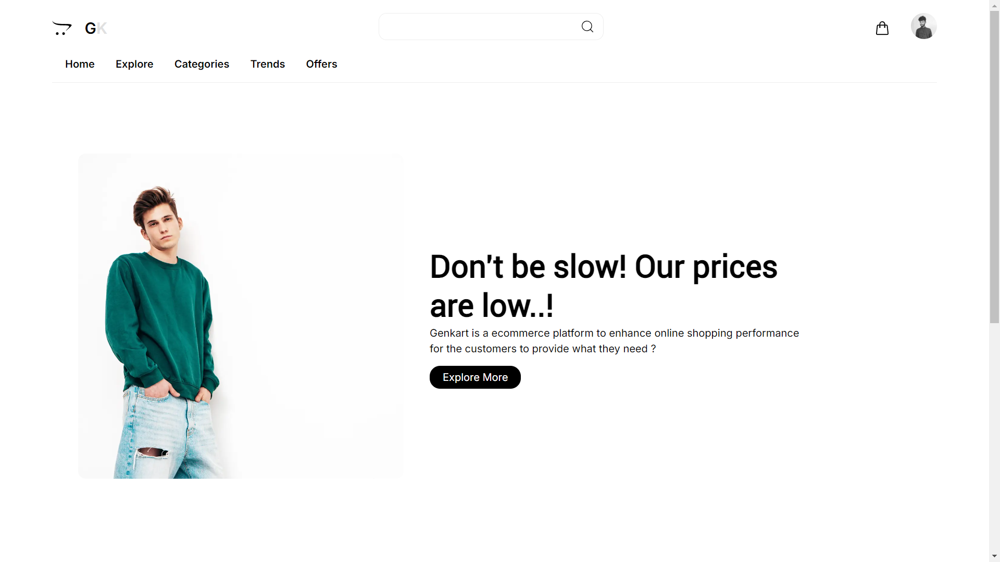
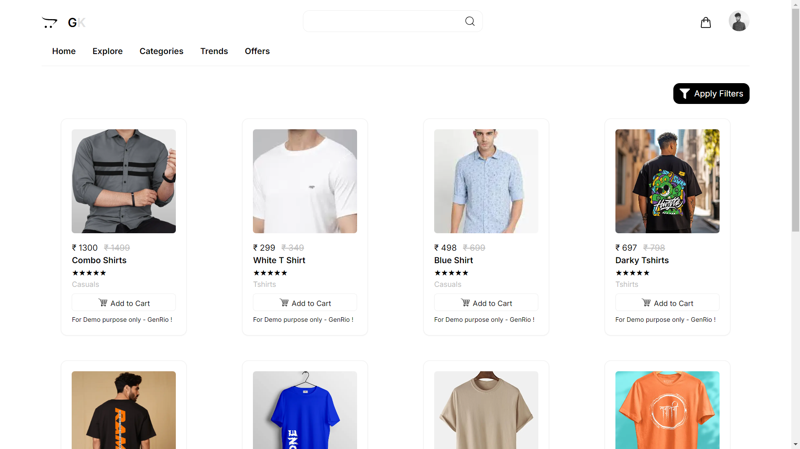
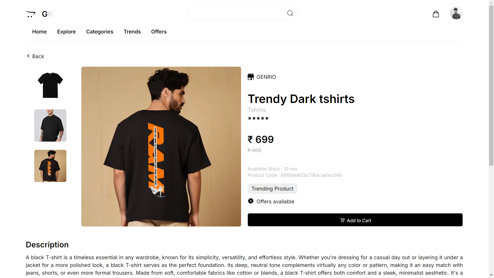
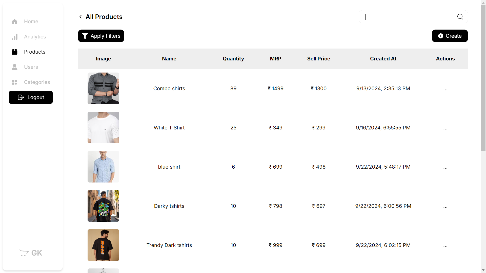

<!-- Badges -->
<p align="center">
  
  
  
  
  
  
  
  
  
</p>

# Genkart-Ecommerce

---

<p align="center">
  
  
  
  
</p>

---

Genkart is a modern, full-stack e-commerce platform built for learning, demo, and real-world DevSecOps. It features a Next.js frontend, Node.js/Express backend, MongoDB Atlas, and a complete GitOps/DevOps pipeline with Docker, Kubernetes, Helm, ArgoCD, GCP (GKE), and Terraform.

---

## Table of Contents
- [Overview](#overview)
- [Tech Stack](#tech-stack)
- [Key Features](#key-features)
- [Project Structure](#project-structure)
- [Getting Started](#getting-started)
- [DevOps & Deployment](#devops--deployment)
- [Admin Account Setup](#admin-account-setup)
- [Admin Login](#admin-login)
- [Contributing](#contributing)
- [License](#license)
- [Contact](#contact)

---

## Overview
Genkart is a production-ready e-commerce platform with a focus on DevSecOps best practices, automation, and developer experience.

---

## Tech Stack
- **Frontend:** Next.js (React)
- **Backend:** Node.js, Express.js
- **Database:** MongoDB Atlas
- **Styling:** Tailwind CSS, Material UI
- **Image Management:** Cloudinary
- **DevOps:** Docker, Kubernetes, Helm, ArgoCD, Terraform, GitHub Actions
- **Security/Quality:** Trivy, SonarQube

---

## Key Features
- JWT-based authentication (admin/customer)
- Product/category CRUD, Cloudinary image storage
- User profile management
- Secure admin dashboard
- Automated CI/CD, security scanning, code quality, GitOps deployment

---

## Project Structure
```
Genkart/
├── client/           # Next.js frontend
├── server/           # Node.js/Express backend
├── helm/             # Helm chart for Kubernetes
├── k8s/              # Raw Kubernetes manifests
├── argocd/           # ArgoCD Application manifests
├── docker-compose.yaml
├── scripts/          # Deployment and automation scripts
├── terraform/        # GCP infrastructure as code
└── README.md
```

---

## Getting Started

### Requirements
- Node.js, Git, Docker, Docker Compose
- Kubernetes (Minikube or GKE), Helm, ArgoCD
- Terraform (for GCP infra)

### Clone & Setup
```sh
git clone https://github.com/Chirag-S-Kotian/genkart.git
cd genkart
```

## Environment Variables

You must create the following environment variable files before running the app:

### /client/.env
```
NEXT_PUBLIC_API=your_backend_api_url (e.g. http://localhost:5555/api or your production URL)
NEXT_PUBLIC_CLIENT_URL=your_frontend_url (e.g. http://localhost:3000/ or your production URL)
NEXT_PUBLIC_JWT_SECRET=your_jwt_secret
NEXT_PUBLIC_JWT_USER_SECRET=your_jwt_user_secret
NEXT_PUBLIC_NODE_ENV=development
```

### /server/.env
```
MONGO_URI=your_mongodb_connection_string
EMAIL_USER=your_email_address
EMAIL_PASS=your_email_password
CLIENT_URL=your_frontend_url (e.g. http://localhost:3000 or your production URL)
NODE_ENV=production
CLOUDINARY_CLOUD_NAME=your_cloudinary_cloud_name
CLOUDINARY_API_KEY=your_cloudinary_api_key
CLOUDINARY_API_SECRET=your_cloudinary_api_secret
CLOUDINARY_FOLDER_NAME=your_cloudinary_folder_name
JWT_SECRET=your_jwt_secret
JWT_USER_SECRET=your_jwt_user_secret
JWT_EXPIRES_IN=1d
```

- Never commit secrets to Git!
- These files are required for both local and production deployments.

### Local Development
- **Docker Compose:**
  ```sh
  docker-compose up --build
  ```
  - Client: http://localhost:3000
  - Server: http://localhost:5555
- **Manual:**
  ```sh
  # Terminal 1
  cd server && npm install && npm start
  # Terminal 2
  cd client && npm install && npm run dev
  ```

---

## DevOps & Deployment

### Docker
- Build & push images:
  ```sh
  ./scripts/build-and-push.sh
  ```

### Kubernetes
- Deploy:
  ```sh
  kubectl apply -f k8s/
  ```
- Delete:
  ```sh
  kubectl delete -f k8s/
  ```

### Helm
- Install/Upgrade:
  ```sh
  helm upgrade --install genkart ./helm --namespace default --create-namespace
  ```
- Uninstall:
  ```sh
  helm uninstall genkart --namespace default
  ```

### ArgoCD GitOps
- Install ArgoCD:
  ```sh
  kubectl create namespace argocd
  kubectl apply -n argocd -f https://raw.githubusercontent.com/argoproj/argo-cd/stable/manifests/install.yaml
  ```
- Apply Application Manifest:
  ```sh
  kubectl apply -f argocd/genkart-app.yaml -n argocd
  ```
- Access UI:
  ```sh
  kubectl port-forward svc/argocd-server -n argocd 8080:443
  # Visit https://localhost:8080
  # Username: admin
  # Password:
  kubectl -n argocd get secret argocd-initial-admin-secret -o jsonpath="{.data.password}" | base64 -d; echo
  ```

### Secret Management
- Use Helm templates for secrets, or external secret managers for production.
- For dev:
  ```sh
  kubectl create secret generic genkart-client-secrets --from-literal=KEY=VALUE
  kubectl create secret generic genkart-server-secrets --from-literal=KEY=VALUE
  ```

### CI/CD & Quality
- **GitHub Actions:** Automated build, test, scan, and deploy.
- **Trivy:** Container image vulnerability scanning.
- **SonarQube:** Code quality and security analysis.

---

## Admin Account Setup
- Admin creation is a one-time backend operation. See `/server/routes/authRoutes.js` for details.
- After creation, comment out the signup route for security.
- Login at `/admin` with your admin credentials.

---

## Admin Login

To access the admin dashboard, log in at [`/admin`](http://localhost:3000/admin) with your admin credentials.

<p align="center">
  
</p>

**Example: Log in as admin using cURL**

```sh
curl -X POST \
  http://localhost:5000/auth/admin/login \
  -H "Content-Type: application/json" \
  -d '{
    "email": "your-admin-email@example.com",
    "password": "your-admin-password"
  }'
```

- On success, you'll receive a JSON response with an `adminToken`.
- Use this token for authenticated admin API requests if needed.

---

## Contributing
Pull requests and issues are welcome! Please open an issue for bugs or feature requests.

---

## License
MIT License. See [LICENSE](LICENSE) for details.

---

## Contact
**Chirag S Kotian**  
- GitHub: [Chirag-S-Kotian](https://github.com/Chirag-S-Kotian)
- LinkedIn: [chirag-s-kotian](https://www.linkedin.com/in/chirag-s-kotian/)
- Email: chirag.mca.2024@pim.ac.in
- Website: [chirag-blockchian.vercel.app](https://chirag-blockchian.vercel.app/)
